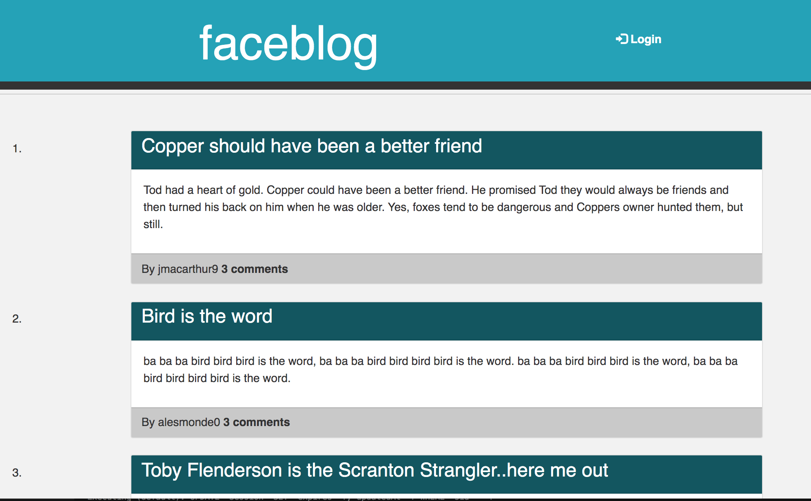
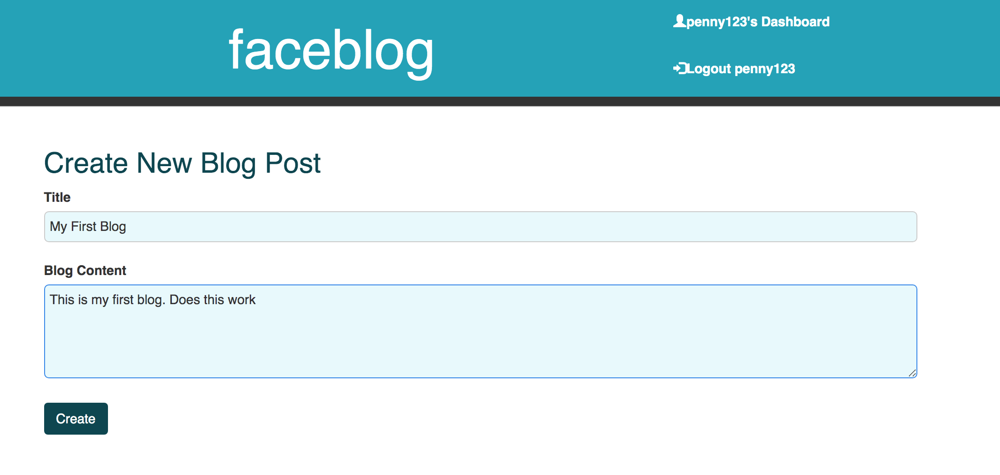
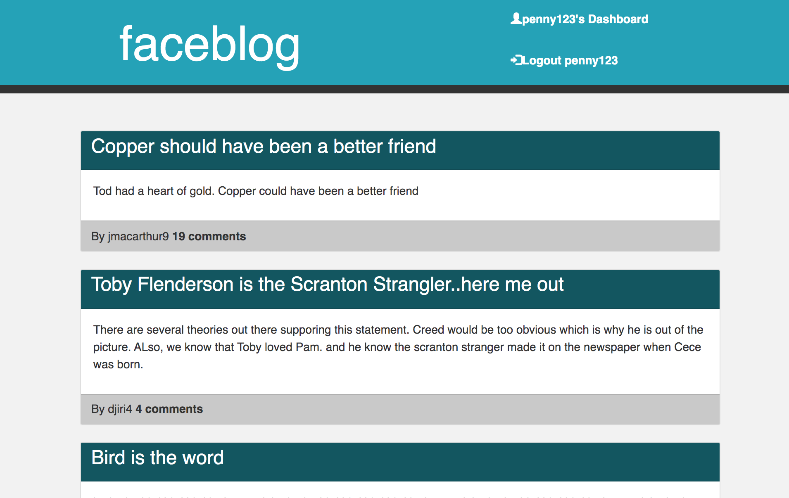

# faceblog
 CMS-style blog site where developers can publish their blog posts and comment on other developers’ posts as well.

 ## User Story
 AS A developer who writes about tech
I WANT a CMS-style blog site
SO THAT I can publish articles, blog posts, and my thoughts and opinions

## Installations
* Express
* Node
* Sequelize
* MySQl
* dotenv
* bcrypt
* Express Handlebars
* Connect session sequelize

## Data base models
* Post
* Users
* Comments

## Acceptance Criteria

## Usage

# Author
[Github: es2013](https://github.com/es2013)

[Deployed Link](https://git.heroku.com/faceblog-2021.git)
